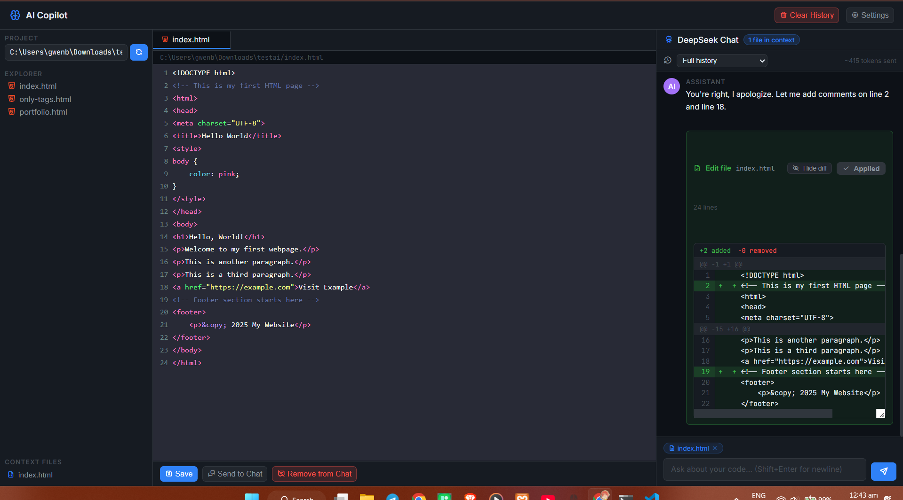

# Local Copilot

A local Copilot-style web IDE that lets you browse, edit, and chat about your project files using the DeepSeek API.

## Features

- 📁 **File Explorer** — browse your local project folder
- 📝 **Code Editor** — open and edit files with syntax-aware textarea
- 💬 **AI Chat** — chat with DeepSeek about your code
- 🧠 **File Context** — attach open files to the chat context
- ✅ **One-click Apply** — AI-suggested edits applied directly to disk
- 🆕 **File Creation** — AI can create new files in your project